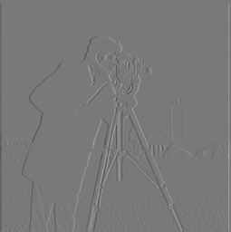
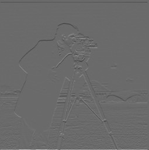
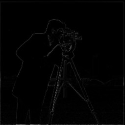
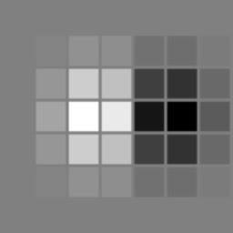
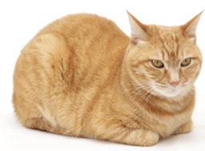
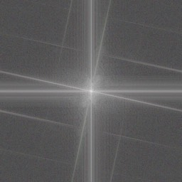
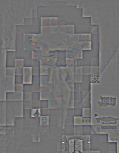
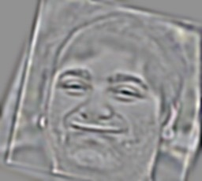
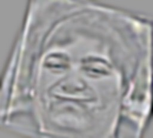

## Part One 
### Finite Difference Operator
In this part of the project, we explore the gradient of an image. This is represented by the convolutions 
$$D_x = \begin{bmatrix}
1 & -1
\end{bmatrix}$$ and 
$$D_y =\begin{bmatrix}
1 \\
-1 
\end{bmatrix}$$
Here is the cameraman image we will be working with: 

{ height=400 }

This is the image convolved with $D_x$

{ height=400 }
  
This is the image convolved with $D_y$

{ height=400 }

We can see that $D_y$ highlights vertical gradients and $D_x$ highlights horizontal gradients. We can construct gradient vectors at every point by taking $[ D_x, D_y ]$. We can plot the magnitude of this vector to combine both the horizontal and vertical edges. 

{ height=400 }

To roughly find all of the edge in the image, we can binarize the magnitide of gradient image. Here is the image with threshold $0.4$

{ height=400 }

### Derivative of Gaussian Filter

For this part, we apply a gaussian filter before applying the derivative filters.

{ height=400 }

{ height=400 }

We can combine the the two filters with convolution and get a new derivatieve of gradient filter.

The y derivative of gaussian is just above but transposed. When using this filter instead, we get the same image, as expected due to the associativity of convolution.

### Image Straightening

In this part of the project, we straightened images based off of the edge orientation histograms. In these examples, we bin orientation vectors on their closest whole degree value, and we pick the rotation with the most in the bins corresponding to the cardinal directions.

| Original | Original Gradient | Straightened | Straightened Gradient
|:--- |:--- |:- |:- |
|  |  |  | |
|  |  |  | |
|  |  |  | |
|  |  |  | |
|  |  |  | |

I actually thought that the cat image would be the failure case since it has soft textures, but the bottom of the cat ended up being a nice enough edge for the algorithm to grab onto it. The building image failed because there are too many edges in various angles due to the geometry of the building. The loaf is an amorphous shape so its hard for the algorithm to find strong edges in any direction. 

## Part 2: Fun with frequencies!

### Image sharpening

For this part of the project, we sharpened images by applying a high pass filter, and adding a scaled version of the resulting image. If $G$ is a gaussian filter, $X$ the image and $\alpha$ the scaling factor, the resulting image is $\alpha(X - G*X) + X = X(\alpha I - \alpha G + I) = X*((\alpha + 1)I - \alpha G)$, where $I$ is the identity filter (the unit impulse). This can be represented with a single filter. 

| Original | Sharpened |
|:--- |:--- |
|  |  |
|  |  |

For evaluation, I blurred the cat image and resharpened it using the filter above.

While the resharpened image does have the detail emphasized, a lot of the finer details have been blurred away and were not recovered. Therefore, while the image has some sharper edges, it does not contain the details of the original image.

### Hybrid images.

In this part of the project, we create hybrid images by combining the high frequencies of one images with the low frequencies of another image.

| High | Low | Combined |
|:--- |:--- |:- |
|  |  |  |
|  |  |  |
|  |  |  |
|  |  |  |

Here, we take the fourier transform of the hybrid image of my roomate, Siddhant, when he was younger and now. The bread cat case did not work because they do not share some of the underlying structure of the image, so the illusion does not work well.

### Laplacian and Gaussian Stacks

In this part of the project, we create Laplacian and Gaussian stacks. This involves applying a low pass filter iteratively to an image to get the Gaussian stack. To get the Laplacian stack, we take the pairwise differences of adjacent images in the gaussian stack. This gives us band passed images. Here, we have a gaussian and laplacian stack of the famous dali painting.

| Gaussian | Laplacian |
|:--- |:--- |
|  |  |
|  |  |
|  |  |
|  |  |
|  |  |

Here, we see that in the first images, we see more of the details of the woman and the scene in the painting, but as we go down we can see more of abraham lincoln.

Now, we use the same example from above and see how my roommate transforms from his new self to his young self.

| Gaussian | Laplacian |
|:--- |:--- |
|  |  |
|  |  |
|  |  |
|  |  |
|  |  |

### Multiresolution blending

For this part of the project, we blend images together using multiresolution blending. To do this, we use low passes on the filter for different frequency bands of the image. 

I used the same half and half mask on the images of my roomate above.

I used the following mask to transfer old Siddhant's hair onto new Siddhants head

Now, we show the frequency bands of the two images and the mask

| Old Sid | New Sid | Mask |
|:--- |:--- |:- |
|  |  |  |
|  |  |  |
|  |  |  |
|  |  |  |
|  |  |  |
